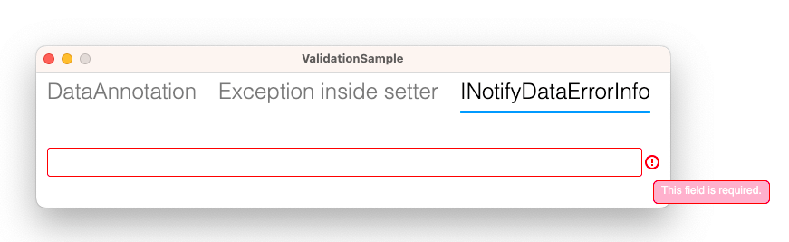
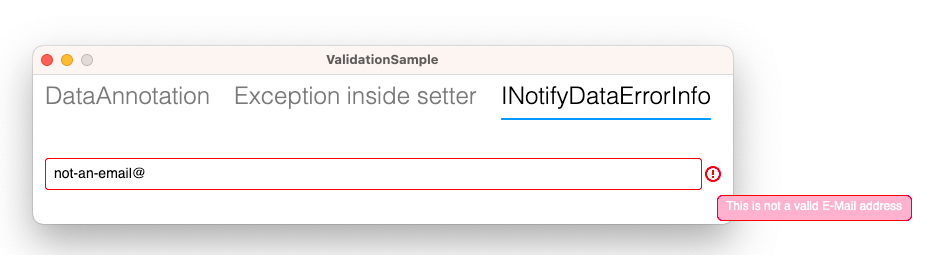
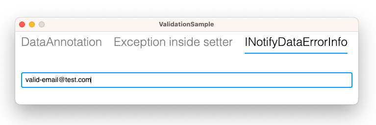

# ⚠️ ValidationSample


## 🔍 **Description**

Basic sample to learn about validation. 3 methods were used:

1. DataAnnotations
2. Exception inside setters
3. `INotifyDataErrorInfo`

## ⚙ **Stack**

- .NET 7
- C# 11
- AvaloniaUI 11.0
- ReactiveUI
- MVVM

## 👀 **Visuals**

<p style="text-align: center;">



</p>

## ⬇️ **Installation**

1. Clone this repo

   HTTPS

   ```sh
   git clone https://github.com/dolbilov/ValidationSample.git
   ```

   SSH

   ```sh
   git clone git@github.com:dolbilov/ValidationSample.git
   ```

   GitHub CLI

   ```sh
   gh repo clone dolbilov/ValidationSample
   ```

2. Restore dependencies

   ```sh
   dotnet restore
   ```

3. Run project
   ```sh
   dotnet run
   ```

## 🤝 **Contributing & Roadmap**

🏁 The project is fully completed. No further development planned. 🏁

## 👤 **Author - Kirill Dolbilov**

- Telegram: [@kdolbilov](https://t.me/kdolbilov)
- GitHub: [@dolbilov](https://github.com/dolbilov)

## 📝 **License**

Copyright &copy; 2023 Kirill Dolbilov  
This project is [GNU GPL v3.0](https://github.com/dolbilov/ValidationSample/blob/main/LICENSE) licensed.
